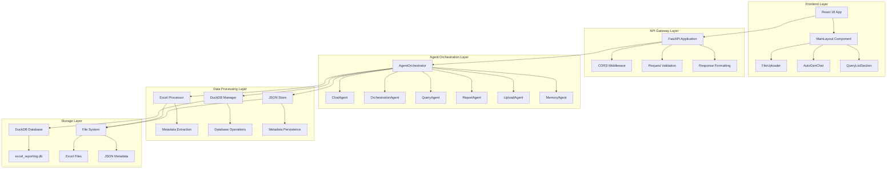
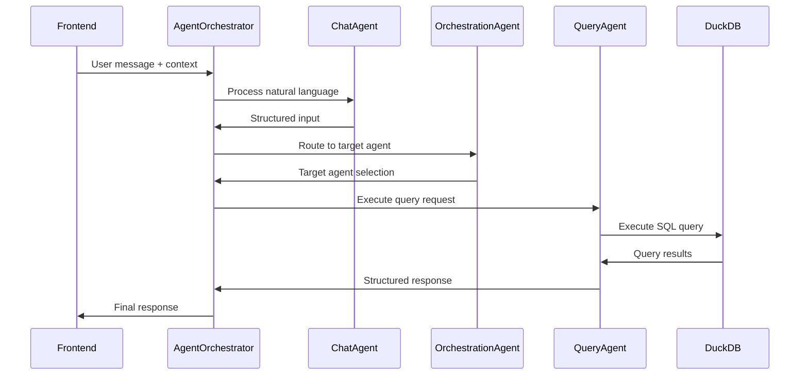
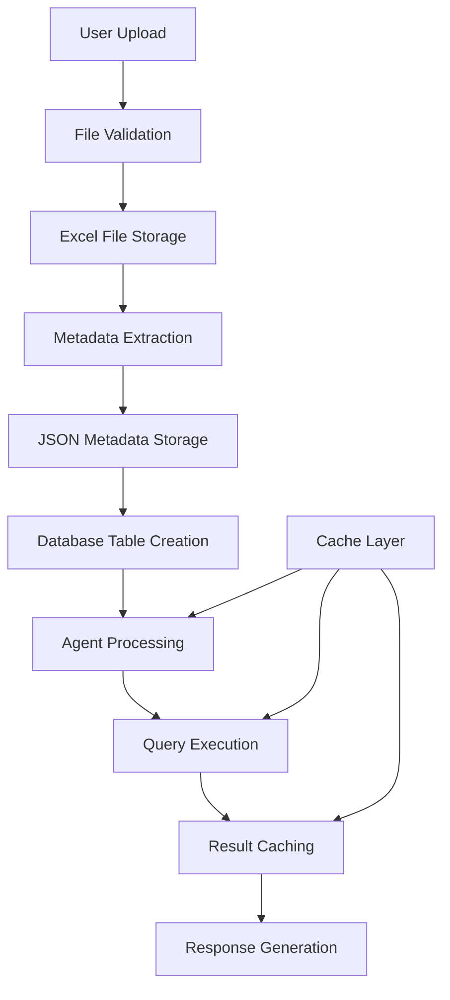

# System Components Documentation - Excel Reporting POC

## Overview

This document provides comprehensive documentation of the internal system architecture, service boundaries, and infrastructure components for the Excel Reporting POC application. It maps all internal systems, configurations, and operational patterns for LangChain integration and system maintenance.

## Table of Contents

1. [System Architecture Overview](#system-architecture-overview)
2. [Service Boundaries and Communication](#service-boundaries-and-communication)
3. [Database Configuration and Management](#database-configuration-and-management)
4. [File System and Storage Specifications](#file-system-and-storage-specifications)
5. [Internal Messaging and Event Systems](#internal-messaging-and-event-systems)
6. [Caching Layers and Data Flow](#caching-layers-and-data-flow)
7. [Security Boundaries and Access Controls](#security-boundaries-and-access-controls)
8. [Performance Characteristics and Scaling](#performance-characteristics-and-scaling)
9. [Monitoring and Health Management](#monitoring-and-health-management)
10. [Deployment and Infrastructure](#deployment-and-infrastructure)

---

## System Architecture Overview

### High-Level Architecture



### Component Responsibilities

| Component | Type | Responsibilities | Dependencies |
|-----------|------|------------------|--------------|
| **FastAPI App** | API Gateway | Request routing, validation, CORS | All backend modules |
| **AgentOrchestrator** | Orchestration | Agent coordination, conversation management | All agents |
| **ChatAgent** | Processing | Natural language input processing | OrchestrationAgent |
| **OrchestrationAgent** | Routing | Intent analysis, agent routing | Agent router utility |
| **QueryAgent** | Processing | SQL generation, query execution | DuckDB Manager |
| **ReportAgent** | Processing | Report generation, formatting | QueryAgent, DuckDB |
| **UploadAgent** | Processing | File management, metadata enrichment | Excel Processor |
| **MemoryAgent** | Storage | Query/report retrieval, history | DuckDB Manager |
| **DuckDB Manager** | Data Layer | Database operations, table management | DuckDB |
| **Excel Processor** | Processing | File parsing, metadata extraction | pandas, openpyxl |
| **JSON Store** | Storage | Metadata persistence, file management | File system |

---

## Service Boundaries and Communication

### 1. API Layer Boundaries

#### FastAPI Application (`app.py`)
```python
# Service boundaries and responsibilities
class FastAPIApplication:
    """
    Main API gateway with 32+ REST endpoints
    
    Boundaries:
    - External: HTTP requests from React frontend
    - Internal: Agent orchestration, data processing
    - Storage: DuckDB, file system, JSON metadata
    """
    
    # CORS Configuration
    CORS_ORIGINS = ["http://localhost:3000"]  # React frontend
    ALLOWED_METHODS = ["*"]
    ALLOWED_HEADERS = ["*"]
    
    # Request/Response Boundaries
    def handle_upload_request(self, files: List[UploadFile]) -> JSONResponse
    def handle_agent_conversation(self, request: Dict) -> JSONResponse
    def handle_query_request(self, request: Dict) -> JSONResponse
    def handle_report_request(self, request: Dict) -> JSONResponse
```

#### Endpoint Categories
- **File Management**: `/upload`, `/check-tables`, `/tables`
- **Agent Processing**: `/autogen-chat`, `/autogen-status`, `/chat-agent`
- **Query Operations**: `/query`, `/save-query`, `/queries`
- **Report Operations**: `/report`, `/save-report`, `/reports`
- **System Health**: `/health`, `/status`

### 2. Agent System Boundaries

#### Agent Orchestrator Pattern
```python
class AgentOrchestrator:
    """
    Central coordination hub for all agent operations
    
    Communication Patterns:
    - Frontend → AgentOrchestrator → Target Agent
    - Agent → AgentOrchestrator → Response
    - Agent ↔ Agent (via OrchestrationAgent)
    """
    
    def __init__(self):
        # Agent registry for routing
        self.agent_registry = {
            "QueryAgent": self.query_agent,
            "ReportAgent": self.report_agent,
            "UploadAgent": self.upload_agent,
            "MemoryAgent": self.memory_agent
        }
    
    async def process_user_message(self, user_input: str, context: Dict) -> Dict:
        """Main entry point for agent processing"""
        # 1. ChatAgent processes natural language
        # 2. OrchestrationAgent routes to target
        # 3. Target agent processes request
        # 4. Return structured response
```

#### Agent Communication Flow


### 3. Data Layer Boundaries

#### DuckDB Manager (`duckdb_manager.py`)
```python
class DuckDBManager:
    """
    Database operations and connection management
    
    Boundaries:
    - External: Agent system, API endpoints
    - Internal: DuckDB connection, table operations
    - Storage: excel_reporting.db file
    """
    
    def create_persistent_database() -> DuckDBPyConnection:
        """Create persistent DuckDB connection"""
        # Database path: backend/excel_reporting.db
        # Connection management and lifecycle
```

#### Excel Processor (`excel_processor.py`)
```python
class ExcelProcessor:
    """
    Excel file processing and metadata extraction
    
    Boundaries:
    - External: Upload endpoints, agent system
    - Internal: pandas, openpyxl operations
    - Storage: File system, JSON metadata
    """
    
    def extract_file_metadata_from_saved_file(file_path: str) -> Dict:
        """Extract metadata from saved Excel file"""
        # File validation, sheet parsing, field extraction
```

---

## Database Configuration and Management

### 1. DuckDB Configuration

#### Database Connection Management
```python
# Database configuration and connection patterns
DATABASE_CONFIG = {
    "database_path": "excel_reporting.db",
    "connection_type": "persistent",
    "location": "backend/",
    "backup_strategy": "file_copy",
    "connection_pooling": False,  # Single connection per request
    "timeout": 30,  # seconds
    "max_connections": 1  # Single-user POC
}

def create_persistent_database() -> DuckDBPyConnection:
    """
    Create persistent DuckDB connection
    
    Configuration:
    - Database file: excel_reporting.db
    - Location: backend directory
    - Persistence: File-based storage
    - Connection lifecycle: Per-request basis
    """
    backend_dir = os.path.dirname(os.path.abspath(__file__))
    db_path = os.path.join(backend_dir, 'excel_reporting.db')
    conn = duckdb.connect(db_path)
    return conn
```

#### Table Management Patterns
```python
# Table creation and management
def create_document_registry_table(conn: DuckDBPyConnection) -> bool:
    """Create document registry table for classification"""
    # Table: document_registry
    # Columns: id, document_type, document_code, field_patterns, created_at
    # Purpose: Store document type classifications

def dataframe_to_table(conn: DuckDBPyConnection, df: pd.DataFrame, table_name: str) -> bool:
    """Convert pandas DataFrame to DuckDB table"""
    # Table naming: {filename}_{document_type_code}_{timestamp}
    # Data conversion: pandas → DuckDB
    # Validation: Column name sanitization
```

### 2. Database Schema Management

#### Core System Tables
```sql
-- Document Registry Table
CREATE TABLE document_registry (
    id INTEGER PRIMARY KEY,
    document_type VARCHAR(100) NOT NULL,
    document_code VARCHAR(10) NOT NULL,
    field_patterns JSON,
    latest_version DECIMAL(3,1) DEFAULT 1.0,
    created_at TIMESTAMP DEFAULT CURRENT_TIMESTAMP,
    UNIQUE(document_type)
);

-- Saved Queries Table
CREATE TABLE saved_queries (
    id INTEGER PRIMARY KEY,
    query_name VARCHAR(200) NOT NULL,
    sql_query TEXT NOT NULL,
    doc_id VARCHAR(100),
    created_at TIMESTAMP DEFAULT CURRENT_TIMESTAMP,
    tags JSON
);

-- Saved Reports Table
CREATE TABLE saved_reports (
    id INTEGER PRIMARY KEY,
    report_name VARCHAR(200) NOT NULL,
    report_config JSON NOT NULL,
    doc_id VARCHAR(100),
    created_at TIMESTAMP DEFAULT CURRENT_TIMESTAMP,
    tags JSON
);
```

#### Dynamic Excel Data Tables
```python
# Dynamic table creation pattern
def create_excel_data_table(conn: DuckDBPyConnection, file_metadata: Dict) -> str:
    """
    Create table for Excel data with standardized naming
    
    Naming Convention: {filename}_{document_type_code}_{timestamp}
    Example: hospital_ledger_gl_20250115_143022
    
    Data Processing:
    - Column name sanitization
    - Data type conversion
    - Index creation for performance
    """
```

### 3. Connection Lifecycle Management

#### Connection Patterns
```python
# Connection lifecycle management
class DatabaseConnectionManager:
    """
    Manages DuckDB connection lifecycle
    
    Patterns:
    - Create connection per request
    - Close connection after processing
    - Error handling and cleanup
    - Connection validation
    """
    
    def get_connection(self) -> DuckDBPyConnection:
        """Get database connection with error handling"""
        try:
            conn = create_persistent_database()
            return conn
        except Exception as e:
            logger.error(f"Database connection failed: {e}")
            raise
    
    def close_connection(self, conn: DuckDBPyConnection):
        """Close connection with cleanup"""
        try:
            conn.close()
        except Exception as e:
            logger.warning(f"Error closing connection: {e}")
```

---

## File System and Storage Specifications

### 1. File Storage Architecture

#### Directory Structure
```
backend/
├── excel_reporting.db          # DuckDB database file
├── stored_queries/             # JSON metadata storage
│   ├── files/                  # Uploaded Excel files
│   │   ├── file1.xlsx
│   │   └── file2.xlsx
│   ├── metadata1.json          # File metadata
│   └── metadata2.json
├── agents/                     # Agent system modules
├── utils/                      # Utility modules
└── app.py                      # FastAPI application
```

#### File Naming Conventions
```python
# File naming patterns
FILE_NAMING_PATTERNS = {
    "excel_files": "{original_filename}",
    "json_metadata": "{base_filename}_{timestamp}.json",
    "duckdb_tables": "{filename}_{document_type_code}_{timestamp}",
    "excel_exports": "{query_name}_{timestamp}.xlsx"
}

# Example naming
# Excel file: hospital_ledger.xlsx
# JSON metadata: hospital_ledger_20250115_143022.json
# DuckDB table: hospital_ledger_gl_20250115_143022
# Excel export: salary_analysis_20250115_143022.xlsx
```

### 2. File Processing Pipeline

#### Upload Processing Flow
```python
# File upload and processing pipeline
class FileProcessingPipeline:
    """
    Complete file processing from upload to storage
    
    Steps:
    1. File validation (format, size, count)
    2. File storage (Excel files to stored_queries/files/)
    3. Metadata extraction (pandas, openpyxl)
    4. Document classification (doc_registry lookup)
    5. Database table creation (DuckDB)
    6. JSON metadata persistence
    """
    
    async def process_uploaded_files(self, files: List[UploadFile]) -> Dict:
        """Process multiple uploaded files"""
        # 1. Validate files
        validation = validate_excel_files(files)
        
        # 2. Save Excel files
        for file in validation["valid_files"]:
            await self.save_excel_file(file)
        
        # 3. Extract metadata
        metadata = self.extract_file_metadata(file_path)
        
        # 4. Create database table
        table_name = self.create_database_table(metadata)
        
        # 5. Save JSON metadata
        self.save_json_metadata(metadata, table_name)
```

#### File Validation Patterns
```python
# File validation and security
class FileValidator:
    """
    File validation and security checks
    
    Validation Rules:
    - File format: .xlsx, .xls only
    - File size: < 50MB per file
    - File count: < 5 files per upload
    - File content: Valid Excel format
    - Security: Path traversal prevention
    """
    
    def validate_excel_files(self, files: List[UploadFile]) -> Dict:
        """Validate uploaded Excel files"""
        validation_result = {
            "valid_files": [],
            "errors": [],
            "total_size": 0
        }
        
        for file in files:
            # Size validation
            if file.size > 50 * 1024 * 1024:  # 50MB
                validation_result["errors"].append(f"File {file.filename} too large")
                continue
            
            # Format validation
            if not file.filename.endswith(('.xlsx', '.xls')):
                validation_result["errors"].append(f"File {file.filename} invalid format")
                continue
            
            validation_result["valid_files"].append(file)
            validation_result["total_size"] += file.size
        
        return validation_result
```

### 3. Storage Management

#### File System Operations
```python
# File system management patterns
class FileSystemManager:
    """
    File system operations and management
    
    Operations:
    - Directory creation and management
    - File read/write operations
    - Path validation and security
    - Cleanup and maintenance
    """
    
    def ensure_directory_exists(self, path: str) -> bool:
        """Ensure directory exists with proper permissions"""
        try:
            os.makedirs(path, exist_ok=True)
            return True
        except Exception as e:
            logger.error(f"Directory creation failed: {e}")
            return False
    
    def save_file_safely(self, file_path: str, content: bytes) -> bool:
        """Save file with security checks"""
        # Path validation
        if not self.is_safe_path(file_path):
            raise ValueError("Unsafe file path")
        
        # Write file
        with open(file_path, 'wb') as f:
            f.write(content)
        
        return True
```

---

## Internal Messaging and Event Systems

### 1. Agent Communication Patterns

#### Message Flow Architecture
```python
# Agent communication patterns
class AgentMessageSystem:
    """
    Internal messaging system for agent communication
    
    Message Types:
    - User Input Messages (Frontend → Agents)
    - Agent Response Messages (Agents → Frontend)
    - Inter-Agent Messages (Agent ↔ Agent)
    - System Status Messages (Internal)
    """
    
    def process_user_message(self, user_input: str, context: Dict) -> Dict:
        """Process user message through agent pipeline"""
        # 1. Structure input (ChatAgent)
        structured_input = self.chat_agent.process_user_input(user_input, context)
        
        # 2. Route to target agent (OrchestrationAgent)
        routing_result = self.orchestration_agent.route_request_to_agent(structured_input)
        
        # 3. Execute with target agent
        target_agent = self.agent_registry[routing_result["target_agent"]]
        result = await target_agent.process_request(structured_input)
        
        # 4. Return structured response
        return self.format_response(result, routing_result)
```

#### Message Format Standards
```python
# Standard message formats
class MessageFormats:
    """Standard message formats for agent communication"""
    
    USER_INPUT_MESSAGE = {
        "user_input": str,
        "localStorage_context": Dict[str, Any],
        "timestamp": str,
        "session_id": str
    }
    
    STRUCTURED_INPUT_MESSAGE = {
        "doc_id": str,
        "query_text": str,
        "intent": str,  # query, report, upload, memory
        "context": Dict[str, Any],
        "datetime_context": Dict[str, str]
    }
    
    AGENT_RESPONSE_MESSAGE = {
        "success": bool,
        "data": Dict[str, Any],
        "routing_info": Dict[str, Any],
        "timestamp": str,
        "agent_name": str
    }
```

### 2. Event Handling Patterns

#### Error Event Handling
```python
# Error event handling patterns
class ErrorEventHandler:
    """
    Error event handling and propagation
    
    Error Types:
    - File Processing Errors
    - Agent Processing Errors
    - Database Errors
    - Validation Errors
    """
    
    def handle_file_processing_error(self, error: Exception, file_path: str) -> Dict:
        """Handle file processing errors"""
        error_event = {
            "error_type": "file_processing",
            "error_message": str(error),
            "file_path": file_path,
            "timestamp": datetime.now().isoformat(),
            "severity": "high"
        }
        
        # Log error
        logger.error(f"File processing error: {error_event}")
        
        # Return error response
        return {
            "success": False,
            "error": error_event,
            "fallback_action": "retry_with_validation"
        }
```

#### Status Event Broadcasting
```python
# Status event broadcasting
class StatusEventBroadcaster:
    """
    Broadcast system status events
    
    Event Types:
    - Agent Status Updates
    - Database Health Status
    - File Processing Status
    - System Performance Metrics
    """
    
    def broadcast_agent_status(self, agent_name: str, status: str) -> None:
        """Broadcast agent status update"""
        status_event = {
            "event_type": "agent_status",
            "agent_name": agent_name,
            "status": status,
            "timestamp": datetime.now().isoformat()
        }
        
        # Log status
        logger.info(f"Agent status update: {status_event}")
        
        # Could integrate with external monitoring systems
        # self.send_to_monitoring_system(status_event)
```

---

## Caching Layers and Data Flow

### 1. In-Memory Caching

#### Agent State Caching
```python
# Agent state caching patterns
class AgentStateCache:
    """
    In-memory caching for agent state and context
    
    Cache Types:
    - Agent conversation history
    - User context and preferences
    - Query result caching
    - Metadata caching
    """
    
    def __init__(self):
        self.conversation_cache = {}
        self.context_cache = {}
        self.query_cache = {}
        self.metadata_cache = {}
    
    def cache_conversation(self, session_id: str, conversation: List[Dict]) -> None:
        """Cache agent conversation history"""
        self.conversation_cache[session_id] = {
            "conversation": conversation,
            "timestamp": datetime.now(),
            "ttl": 3600  # 1 hour TTL
        }
    
    def get_cached_context(self, doc_id: str) -> Optional[Dict]:
        """Get cached document context"""
        if doc_id in self.context_cache:
            context = self.context_cache[doc_id]
            if datetime.now() - context["timestamp"] < timedelta(hours=1):
                return context["data"]
        return None
```

#### Query Result Caching
```python
# Query result caching
class QueryResultCache:
    """
    Cache query results for performance optimization
    
    Caching Strategy:
    - Cache frequent queries
    - TTL-based expiration
    - Memory-based eviction
    - Cache invalidation on data changes
    """
    
    def cache_query_result(self, query_hash: str, result: Dict) -> None:
        """Cache query result with TTL"""
        self.query_cache[query_hash] = {
            "result": result,
            "timestamp": datetime.now(),
            "ttl": 1800  # 30 minutes TTL
        }
    
    def get_cached_result(self, query_hash: str) -> Optional[Dict]:
        """Get cached query result"""
        if query_hash in self.query_cache:
            cached = self.query_cache[query_hash]
            if datetime.now() - cached["timestamp"] < timedelta(seconds=cached["ttl"]):
                return cached["result"]
            else:
                # Remove expired cache
                del self.query_cache[query_hash]
        return None
```

### 2. Data Flow Patterns

#### Data Flow Architecture


#### Data Transformation Pipeline
```python
# Data transformation pipeline
class DataTransformationPipeline:
    """
    Data transformation from Excel to database
    
    Pipeline Steps:
    1. Excel file → pandas DataFrame
    2. DataFrame → normalized column names
    3. DataFrame → DuckDB table
    4. Metadata → JSON storage
    5. Classification → document registry
    """
    
    def transform_excel_to_database(self, file_path: str) -> Dict:
        """Transform Excel file to database table"""
        # 1. Load Excel file
        df = pd.read_excel(file_path)
        
        # 2. Normalize column names
        df.columns = [self.normalize_column_name(col) for col in df.columns]
        
        # 3. Create database table
        table_name = self.generate_table_name(file_path)
        self.create_database_table(df, table_name)
        
        # 4. Extract and store metadata
        metadata = self.extract_metadata(df, file_path)
        self.store_metadata(metadata)
        
        return {
            "table_name": table_name,
            "row_count": len(df),
            "column_count": len(df.columns),
            "metadata": metadata
        }
```

---

## Security Boundaries and Access Controls

### 1. Input Validation and Sanitization

#### File Upload Security
```python
# File upload security patterns
class FileUploadSecurity:
    """
    Security measures for file upload operations
    
    Security Measures:
    - File type validation
    - File size limits
    - Path traversal prevention
    - Malicious content detection
    - Virus scanning (if implemented)
    """
    
    def validate_file_security(self, file: UploadFile) -> Dict[str, Any]:
        """Validate file for security threats"""
        security_checks = {
            "is_safe": True,
            "threats_detected": [],
            "recommendations": []
        }
        
        # File extension validation
        if not self.is_safe_file_extension(file.filename):
            security_checks["is_safe"] = False
            security_checks["threats_detected"].append("Unsafe file extension")
        
        # File size validation
        if file.size > self.MAX_FILE_SIZE:
            security_checks["is_safe"] = False
            security_checks["threats_detected"].append("File size exceeds limit")
        
        # Path traversal prevention
        if self.contains_path_traversal(file.filename):
            security_checks["is_safe"] = False
            security_checks["threats_detected"].append("Path traversal attempt")
        
        return security_checks
```

#### SQL Injection Prevention
```python
# SQL injection prevention
class SQLSecurityManager:
    """
    SQL injection prevention and query security
    
    Security Measures:
    - Parameterized queries only
    - Input sanitization
    - Query validation
    - Access control
    """
    
    def execute_safe_query(self, conn: DuckDBPyConnection, query: str, params: Dict) -> Dict:
        """Execute SQL query with security measures"""
        # Validate query structure
        if not self.is_safe_query(query):
            raise ValueError("Unsafe query detected")
        
        # Sanitize parameters
        sanitized_params = self.sanitize_parameters(params)
        
        # Execute with parameterized query
        try:
            result = conn.execute(query, sanitized_params).fetchall()
            return {"success": True, "data": result}
        except Exception as e:
            logger.error(f"Query execution failed: {e}")
            return {"success": False, "error": str(e)}
```

### 2. Access Control Patterns

#### API Access Control
```python
# API access control patterns
class APIAccessControl:
    """
    API access control and rate limiting
    
    Access Control:
    - CORS configuration
    - Rate limiting
    - Request validation
    - Error handling
    """
    
    def __init__(self):
        self.rate_limiter = RateLimiter()
        self.cors_config = {
            "allow_origins": ["http://localhost:3000"],
            "allow_methods": ["GET", "POST", "PUT", "DELETE"],
            "allow_headers": ["*"],
            "allow_credentials": True
        }
    
    def validate_request(self, request: Request) -> bool:
        """Validate incoming request"""
        # Rate limiting check
        if not self.rate_limiter.is_allowed(request.client.host):
            return False
        
        # CORS validation
        if not self.validate_cors(request):
            return False
        
        return True
```

#### Database Access Control
```python
# Database access control
class DatabaseAccessControl:
    """
    Database access control and permissions
    
    Access Control:
    - Connection limits
    - Query permissions
    - Data access restrictions
    - Audit logging
    """
    
    def __init__(self):
        self.max_connections = 1  # Single-user POC
        self.active_connections = 0
        self.audit_log = []
    
    def check_connection_permission(self) -> bool:
        """Check if new connection is allowed"""
        if self.active_connections >= self.max_connections:
            return False
        return True
    
    def log_database_access(self, operation: str, table: str, user: str) -> None:
        """Log database access for audit"""
        audit_entry = {
            "timestamp": datetime.now().isoformat(),
            "operation": operation,
            "table": table,
            "user": user
        }
        self.audit_log.append(audit_entry)
```

---

## Performance Characteristics and Scaling

### 1. Performance Metrics

#### Response Time Characteristics
```python
# Performance metrics and monitoring
class PerformanceMonitor:
    """
    Performance monitoring and metrics collection
    
    Metrics:
    - Response times
    - Throughput
    - Resource usage
    - Error rates
    """
    
    def __init__(self):
        self.metrics = {
            "response_times": [],
            "throughput": 0,
            "error_rate": 0.0,
            "resource_usage": {}
        }
    
    def record_response_time(self, endpoint: str, duration: float) -> None:
        """Record response time for endpoint"""
        self.metrics["response_times"].append({
            "endpoint": endpoint,
            "duration": duration,
            "timestamp": datetime.now()
        })
    
    def calculate_average_response_time(self) -> float:
        """Calculate average response time"""
        if not self.metrics["response_times"]:
            return 0.0
        
        total_time = sum(rt["duration"] for rt in self.metrics["response_times"])
        return total_time / len(self.metrics["response_times"])
```

#### Resource Usage Patterns
```python
# Resource usage monitoring
class ResourceUsageMonitor:
    """
    Monitor system resource usage
    
    Resources Monitored:
    - Memory usage
    - CPU usage
    - Disk usage
    - Database connections
    """
    
    def get_memory_usage(self) -> Dict[str, Any]:
        """Get current memory usage"""
        import psutil
        memory = psutil.virtual_memory()
        return {
            "total": memory.total,
            "available": memory.available,
            "used": memory.used,
            "percentage": memory.percent
        }
    
    def get_database_usage(self) -> Dict[str, Any]:
        """Get database usage statistics"""
        # Get database file size
        db_path = "excel_reporting.db"
        if os.path.exists(db_path):
            size = os.path.getsize(db_path)
            return {
                "file_size": size,
                "file_size_mb": size / (1024 * 1024)
            }
        return {"file_size": 0, "file_size_mb": 0}
```

### 2. Scaling Considerations

#### Horizontal Scaling Patterns
```python
# Scaling patterns and strategies
class ScalingManager:
    """
    Scaling strategies and resource management
    
    Scaling Strategies:
    - Horizontal scaling (multiple instances)
    - Vertical scaling (resource increase)
    - Database scaling
    - Caching strategies
    """
    
    def __init__(self):
        self.scaling_config = {
            "max_instances": 3,
            "min_instances": 1,
            "scale_up_threshold": 0.8,  # 80% CPU
            "scale_down_threshold": 0.3  # 30% CPU
        }
    
    def should_scale_up(self, current_metrics: Dict) -> bool:
        """Determine if system should scale up"""
        cpu_usage = current_metrics.get("cpu_usage", 0)
        memory_usage = current_metrics.get("memory_usage", 0)
        
        return (cpu_usage > self.scaling_config["scale_up_threshold"] or
                memory_usage > self.scaling_config["scale_up_threshold"])
    
    def should_scale_down(self, current_metrics: Dict) -> bool:
        """Determine if system should scale down"""
        cpu_usage = current_metrics.get("cpu_usage", 0)
        memory_usage = current_metrics.get("memory_usage", 0)
        
        return (cpu_usage < self.scaling_config["scale_down_threshold"] and
                memory_usage < self.scaling_config["scale_down_threshold"])
```

#### Database Scaling
```python
# Database scaling strategies
class DatabaseScalingManager:
    """
    Database scaling and optimization strategies
    
    Scaling Strategies:
    - Connection pooling
    - Query optimization
    - Index optimization
    - Partitioning strategies
    """
    
    def optimize_database_performance(self, conn: DuckDBPyConnection) -> None:
        """Optimize database performance"""
        # Create indexes for frequently queried columns
        self.create_performance_indexes(conn)
        
        # Analyze query performance
        self.analyze_query_performance(conn)
        
        # Optimize table structures
        self.optimize_table_structures(conn)
    
    def create_performance_indexes(self, conn: DuckDBPyConnection) -> None:
        """Create performance indexes"""
        # Index on document_type for fast lookups
        conn.execute("CREATE INDEX IF NOT EXISTS idx_document_type ON document_registry(document_type)")
        
        # Index on doc_id for fast queries
        conn.execute("CREATE INDEX IF NOT EXISTS idx_doc_id ON saved_queries(doc_id)")
        conn.execute("CREATE INDEX IF NOT EXISTS idx_doc_id_reports ON saved_reports(doc_id)")
```

---

## Monitoring and Health Management

### 1. Health Check Systems

#### System Health Monitoring
```python
# System health monitoring
class SystemHealthMonitor:
    """
    Comprehensive system health monitoring
    
    Health Checks:
    - API endpoint health
    - Database connectivity
    - Agent system health
    - File system health
    - Resource availability
    """
    
    def __init__(self):
        self.health_checks = {
            "api_health": self.check_api_health,
            "database_health": self.check_database_health,
            "agent_health": self.check_agent_health,
            "file_system_health": self.check_file_system_health
        }
    
    def perform_health_check(self) -> Dict[str, Any]:
        """Perform comprehensive health check"""
        health_status = {
            "overall_health": "healthy",
            "timestamp": datetime.now().isoformat(),
            "checks": {}
        }
        
        for check_name, check_function in self.health_checks.items():
            try:
                result = check_function()
                health_status["checks"][check_name] = result
                
                if not result["healthy"]:
                    health_status["overall_health"] = "unhealthy"
            except Exception as e:
                health_status["checks"][check_name] = {
                    "healthy": False,
                    "error": str(e)
                }
                health_status["overall_health"] = "unhealthy"
        
        return health_status
    
    def check_database_health(self) -> Dict[str, Any]:
        """Check database health and connectivity"""
        try:
            conn = create_persistent_database()
            result = conn.execute("SELECT 1").fetchone()
            conn.close()
            
            return {
                "healthy": True,
                "database_file": "excel_reporting.db",
                "connection_status": "active"
            }
        except Exception as e:
            return {
                "healthy": False,
                "error": str(e),
                "connection_status": "failed"
            }
```

#### Agent Health Monitoring
```python
# Agent health monitoring
class AgentHealthMonitor:
    """
    Monitor agent system health and performance
    
    Agent Health Metrics:
    - Agent availability
    - Response times
    - Error rates
    - Memory usage
    """
    
    def check_agent_health(self) -> Dict[str, Any]:
        """Check health of all agents"""
        agent_health = {
            "overall_health": "healthy",
            "agents": {}
        }
        
        # Check each agent
        agents = ["ChatAgent", "OrchestrationAgent", "QueryAgent", 
                 "ReportAgent", "UploadAgent", "MemoryAgent"]
        
        for agent_name in agents:
            try:
                # Check if agent can be instantiated
                agent_status = self.check_agent_status(agent_name)
                agent_health["agents"][agent_name] = agent_status
                
                if not agent_status["healthy"]:
                    agent_health["overall_health"] = "unhealthy"
            except Exception as e:
                agent_health["agents"][agent_name] = {
                    "healthy": False,
                    "error": str(e)
                }
                agent_health["overall_health"] = "unhealthy"
        
        return agent_health
```

### 2. Alerting and Notification Systems

#### Alert Configuration
```python
# Alerting system configuration
class AlertingSystem:
    """
    Alerting and notification system
    
    Alert Types:
    - System errors
    - Performance degradation
    - Resource exhaustion
    - Security incidents
    """
    
    def __init__(self):
        self.alert_thresholds = {
            "error_rate": 0.05,  # 5% error rate
            "response_time": 10.0,  # 10 seconds
            "memory_usage": 0.9,  # 90% memory usage
            "disk_usage": 0.8  # 80% disk usage
        }
    
    def check_alert_conditions(self, metrics: Dict) -> List[Dict]:
        """Check if alert conditions are met"""
        alerts = []
        
        # Check error rate
        if metrics.get("error_rate", 0) > self.alert_thresholds["error_rate"]:
            alerts.append({
                "type": "error_rate_high",
                "severity": "high",
                "message": f"Error rate {metrics['error_rate']:.2%} exceeds threshold"
            })
        
        # Check response time
        if metrics.get("avg_response_time", 0) > self.alert_thresholds["response_time"]:
            alerts.append({
                "type": "response_time_slow",
                "severity": "medium",
                "message": f"Average response time {metrics['avg_response_time']:.2f}s exceeds threshold"
            })
        
        return alerts
```

---

## Deployment and Infrastructure

### 1. Deployment Architecture

#### Production Deployment
```yaml
# Production deployment configuration
production_deployment:
  frontend:
    platform: "Azure Static Web Apps"
    build_command: "npm run build"
    output_directory: "build"
    environment: "production"
    
  backend:
    platform: "Azure App Service"
    runtime: "Python 3.11"
    framework: "FastAPI"
    environment: "production"
    
  database:
    type: "DuckDB"
    storage: "Azure Blob Storage"
    backup_strategy: "daily"
    
  monitoring:
    platform: "Azure Monitor"
    logging: "Application Insights"
    alerting: "Azure Alerts"
```

#### Development Environment
```yaml
# Development environment configuration
development_environment:
  frontend:
    platform: "localhost:3000"
    framework: "React 18"
    hot_reload: true
    
  backend:
    platform: "localhost:8000"
    framework: "FastAPI"
    debug_mode: true
    
  database:
    type: "DuckDB"
    storage: "local_file"
    file: "excel_reporting.db"
```

### 2. Infrastructure Requirements

#### System Requirements
```python
# System requirements and specifications
SYSTEM_REQUIREMENTS = {
    "minimum_requirements": {
        "cpu": "2 cores",
        "memory": "4GB RAM",
        "storage": "10GB SSD",
        "network": "100 Mbps"
    },
    "recommended_requirements": {
        "cpu": "4 cores",
        "memory": "8GB RAM",
        "storage": "50GB SSD",
        "network": "1 Gbps"
    },
    "production_requirements": {
        "cpu": "8 cores",
        "memory": "16GB RAM",
        "storage": "100GB SSD",
        "network": "10 Gbps"
    }
}
```

#### Dependencies and Versions
```python
# System dependencies and versions
SYSTEM_DEPENDENCIES = {
    "backend": {
        "python": "3.11",
        "fastapi": "0.104.1",
        "duckdb": "0.9.2",
        "pandas": "2.1.4",
        "openpyxl": "3.1.2",
        "autogen": "0.2.0"
    },
    "frontend": {
        "node": "18.17.0",
        "react": "18.2.0",
        "axios": "1.6.2",
        "tailwindcss": "3.3.6"
    },
    "ai": {
        "openai": "1.3.7",
        "gpt-4": "cost-optimized"
    }
}
```

---

## Summary

This System Components Documentation provides comprehensive coverage of:

1. **System Architecture**: Complete system overview with component responsibilities
2. **Service Boundaries**: Clear definition of service boundaries and communication patterns
3. **Database Management**: DuckDB configuration, schema management, and connection patterns
4. **File System Operations**: File storage, processing, and security patterns
5. **Internal Messaging**: Agent communication and event handling systems
6. **Caching Strategies**: In-memory caching and data flow optimization
7. **Security Measures**: Input validation, access control, and threat prevention
8. **Performance Monitoring**: Metrics collection, scaling strategies, and optimization
9. **Health Management**: System health checks, alerting, and monitoring
10. **Deployment Infrastructure**: Production and development deployment configurations

This documentation enables effective system maintenance, LangChain integration, and provides a solid foundation for the AutoGen to LangChain migration process.
