# Workflow Orchestration Guide - Excel Reporting POC

## Overview

This document provides comprehensive workflow orchestration patterns for the Excel Reporting POC application. It maps the complete user journey from file upload to report generation, documents agent conversation flows, and provides reusable workflow templates for LangChain integration.

## Table of Contents

1. [End-to-End User Workflows](#end-to-end-user-workflows)
2. [Agent Conversation Flows](#agent-conversation-flows)
3. [Multi-Step Process Mapping](#multi-step-process-mapping)
4. [Error Handling and Rollback Procedures](#error-handling-and-rollback-procedures)
5. [User Interaction Points and Decision Gates](#user-interaction-points-and-decision-gates)
6. [Workflow Templates](#workflow-templates)
7. [State Management Patterns](#state-management-patterns)
8. [Monitoring and Alerting](#monitoring-and-alerting)
9. [Testing Strategies](#testing-strategies)

---

## End-to-End User Workflows

### 1. Primary Workflow: File Upload → Analysis → Query → Report

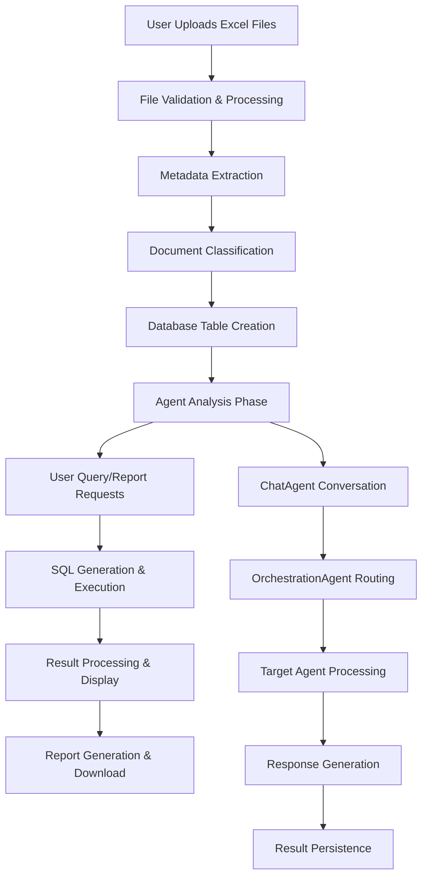

**Detailed Steps:**

#### Phase 1: File Upload & Processing
1. **File Upload** (`POST /upload`)
   - User selects 1-5 Excel files via frontend
   - Files validated for format (.xlsx/.xls) and size (<50MB each)
   - Files stored temporarily for processing

2. **Metadata Extraction** (`excel_processor.py`)
   - Extract sheet names, field names, data types
   - Generate standardized field mappings
   - Create file metadata JSON

3. **Document Classification** (`doc_registry` lookup)
   - Compare field patterns against `document_registry`
   - Determine document type and version
   - Create or update classification records

4. **Database Integration** (`duckdb_manager.py`)
   - Create standardized DuckDB table names
   - Convert Excel data to SQLite-compatible format
   - Store data in persistent database

#### Phase 2: Agent Analysis & Conversation
5. **ChatAgent Processing** (`agents/chat_agent.py`)
   - Process natural language input from user
   - Structure input with doc_id, query_text, context
   - Inject localStorage context (schema, metadata)

6. **OrchestrationAgent Routing** (`agents/orchestration_agent.py`)
   - Analyze user intent (query, report, upload, memory)
   - Route to appropriate downstream agent
   - Handle disambiguation and fallback routing

7. **Target Agent Processing**
   - **QueryAgent**: Generate SQL from natural language
   - **ReportAgent**: Create formatted reports with filters
   - **UploadAgent**: Handle file management operations
   - **MemoryAgent**: Manage conversation history

#### Phase 3: Query & Report Generation
8. **SQL Generation & Execution**
   - LLM generates SQL from user intent
   - Query executed against DuckDB
   - Results formatted for display

9. **Report Processing**
   - Apply filters, grouping, formatting
   - Generate multiple output formats (HTML, XLSX, JSON)
   - Auto-save with intelligent naming

10. **Result Persistence & Display**
    - Save queries to `saved_queries` table
    - Save reports to `saved_reports` table
    - Update frontend with results

### 2. Multi-File Workflow Pattern

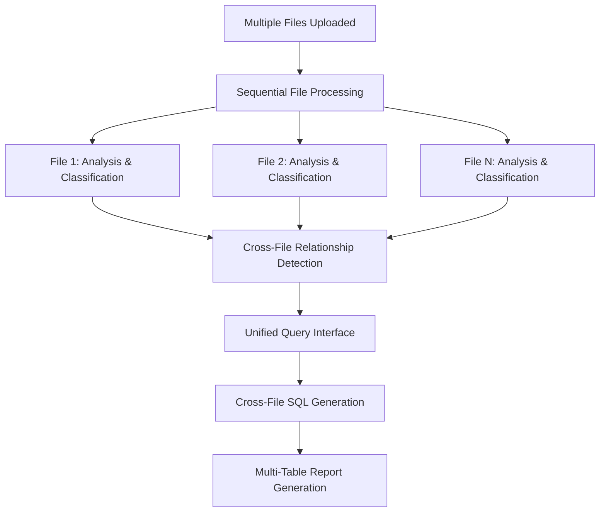

**Key Features:**
- Sequential processing of multiple files
- Cross-file relationship detection
- Unified query interface across all files
- Multi-table report generation

### 3. Error Recovery Workflow

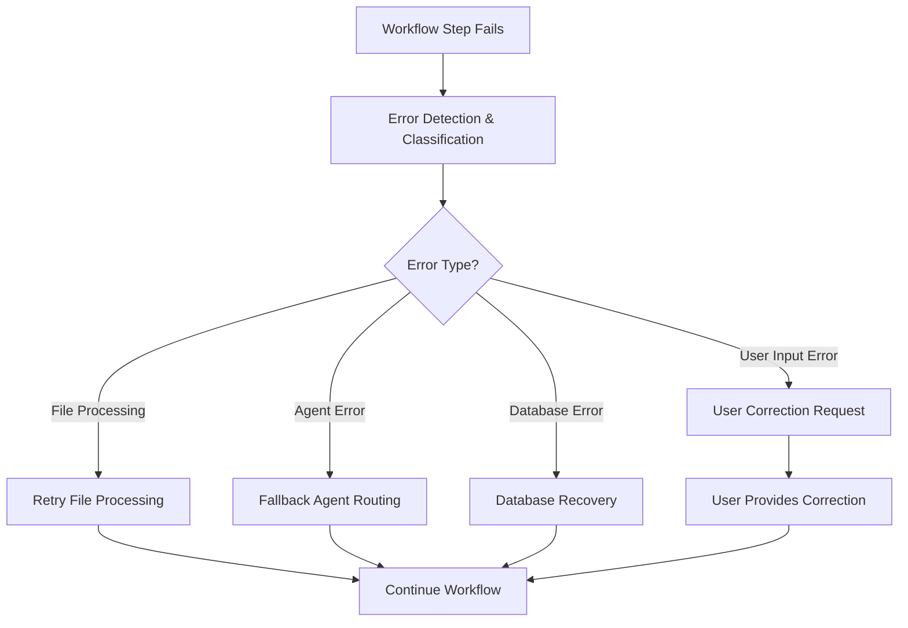

---

## Agent Conversation Flows

### 1. ChatAgent → OrchestrationAgent → Target Agent Flow

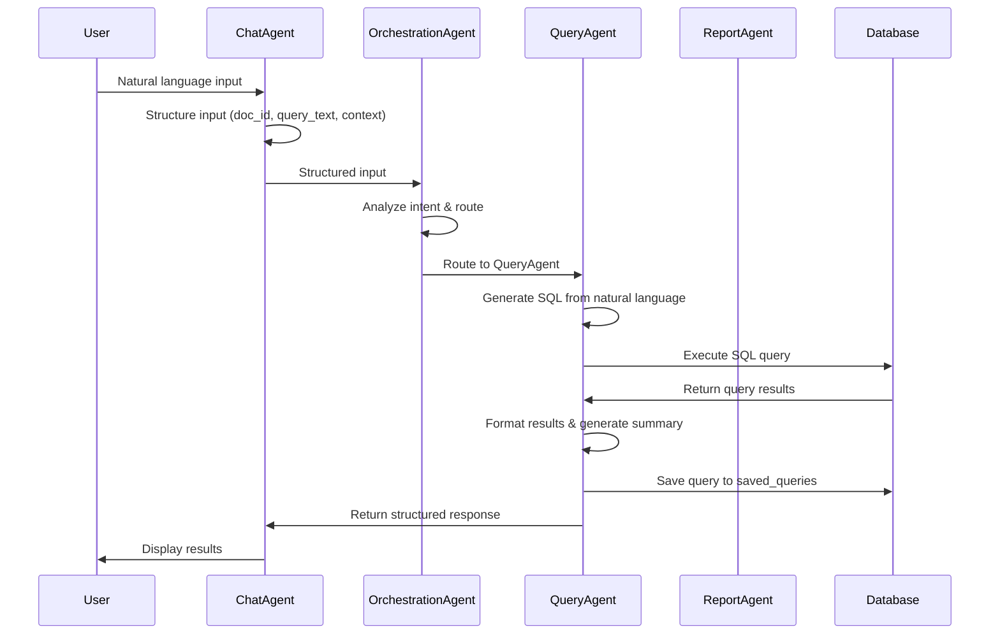

### 2. Agent Decision Points and Routing Logic

#### OrchestrationAgent Routing Decision Tree

```mermaid
graph TD
    A[Structured Input Received] --> B{Intent Analysis}
    
    B -->|Contains "query", "show", "list", "find"| C[Route to QueryAgent]
    B -->|Contains "report", "summary", "export"| D[Route to ReportAgent]
    B -->|Contains "upload", "file", "new"| E[Route to UploadAgent]
    B -->|Contains "history", "previous", "saved"| F[Route to MemoryAgent]
    B -->|Unclear Intent| G[LLM Disambiguation]
    
    G -->|Query Intent| C
    G -->|Report Intent| D
    G -->|Upload Intent| E
    G -->|Memory Intent| F
    G -->|Still Unclear| H[Default to QueryAgent]
    
    C --> I[Query Processing]
    D --> J[Report Processing]
    E --> K[Upload Processing]
    F --> L[Memory Processing]
    H --> I
```

#### Agent Conversation State Management

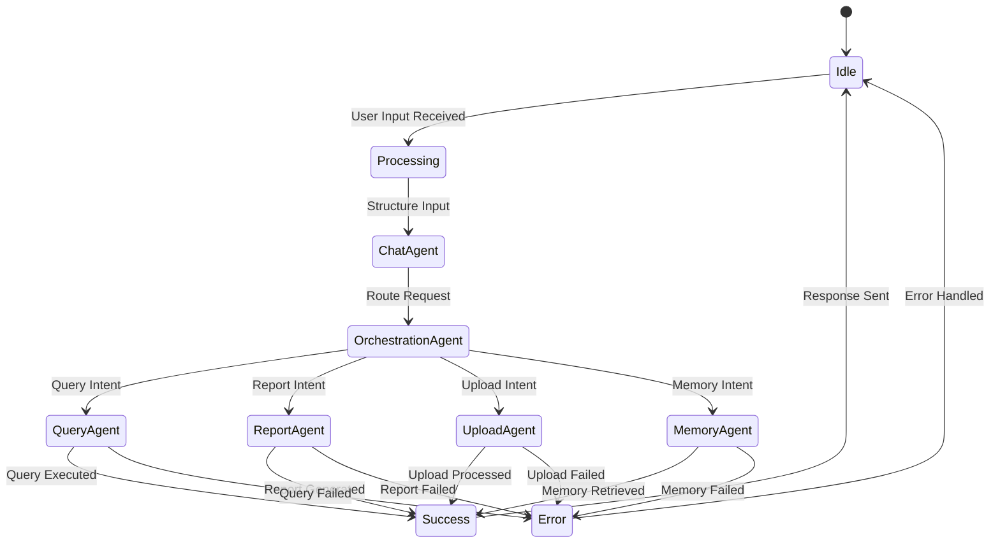

### 3. Agent Error Handling and Fallback Patterns

#### Error Classification and Response

| Error Type | Agent | Fallback Action | User Notification |
|------------|-------|-----------------|-------------------|
| SQL Generation Error | QueryAgent | Use simplified query | "Query simplified, please refine" |
| Report Generation Error | ReportAgent | Generate basic report | "Basic report generated" |
| File Processing Error | UploadAgent | Retry with validation | "File processing retrying" |
| Memory Retrieval Error | MemoryAgent | Return empty history | "No previous data found" |
| Routing Error | OrchestrationAgent | Default to QueryAgent | "Processing as query request" |

#### Agent Conversation Recovery

```python
# Example error handling pattern from agents
try:
    result = await target_agent.process_request(structured_input)
    if result.get("success"):
        return result
    else:
        # Agent-specific error handling
        return await handle_agent_error(target_agent, result, structured_input)
except Exception as e:
    # Fallback to safe default
    return {
        "success": False,
        "error": f"Agent processing failed: {str(e)}",
        "fallback_action": "retry_with_simplified_request"
    }
```

---

## Multi-Step Process Mapping

### 1. File Upload Process Sequence

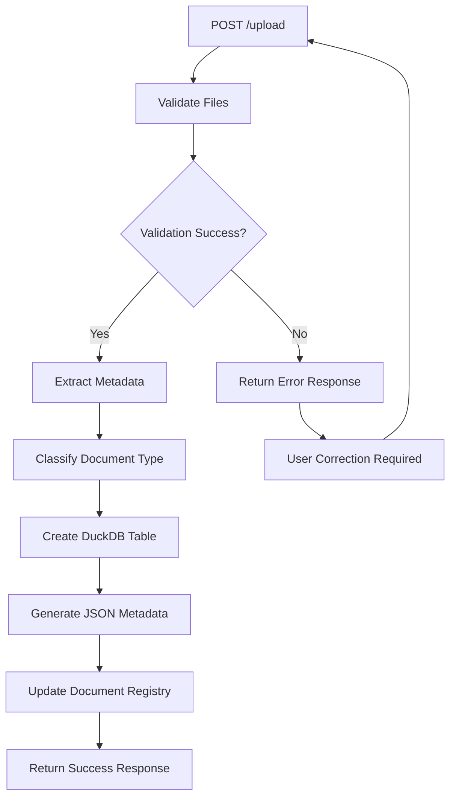

**API Call Sequence:**
1. `POST /upload` - File upload endpoint
2. `excel_processor.validate_excel_files()` - File validation
3. `excel_processor.extract_file_metadata_from_saved_file()` - Metadata extraction
4. `duckdb_manager.create_persistent_database()` - Database operations
5. `utils.json_store.load_metadata()` - Metadata management

### 2. Query Processing Sequence

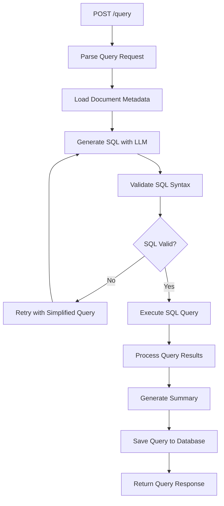

**API Call Sequence:**
1. `POST /query` - Query endpoint
2. `utils.json_store.load_metadata()` - Load document context
3. `agents.query_agent._generate_sql()` - SQL generation
4. `utils.duckdb_manager.execute_query()` - Query execution
5. `utils.duckdb_manager.save_query()` - Query persistence

### 3. Report Generation Sequence

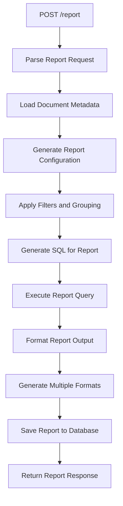

### 4. Agent Orchestration Sequence

```mermaid
graph TD
    A[POST /autogen-chat] --> B[Initialize AgentOrchestrator]
    B --> C[ChatAgent.process_user_input()]
    C --> D[OrchestrationAgent.route_request_to_agent()]
    D --> E{Target Agent?}
    
    E -->|QueryAgent| F[QueryAgent.process_query_request()]
    E -->|ReportAgent| G[ReportAgent.process_report_request()]
    E -->|UploadAgent| H[UploadAgent.process_upload_request()]
    E -->|MemoryAgent| I[MemoryAgent.process_memory_request()]
    
    F --> J[Return Query Results]
    G --> K[Return Report Results]
    H --> L[Return Upload Results]
    I --> M[Return Memory Results]
    
    J --> N[Format Final Response]
    K --> N
    L --> N
    M --> N
    N --> O[Return to Frontend]
```

---

## Error Handling and Rollback Procedures

### 1. Error Classification System

#### File Processing Errors
```python
# Error types and handling strategies
FILE_PROCESSING_ERRORS = {
    "INVALID_FORMAT": {
        "severity": "high",
        "user_action": "reupload_valid_file",
        "system_action": "reject_file",
        "rollback": "none"
    },
    "SIZE_EXCEEDED": {
        "severity": "medium", 
        "user_action": "reduce_file_size",
        "system_action": "reject_file",
        "rollback": "none"
    },
    "CORRUPTED_FILE": {
        "severity": "high",
        "user_action": "reupload_file",
        "system_action": "cleanup_partial_data",
        "rollback": "remove_partial_metadata"
    }
}
```

#### Agent Processing Errors
```python
# Agent error handling patterns
AGENT_ERRORS = {
    "ROUTING_FAILURE": {
        "severity": "medium",
        "fallback": "default_to_query_agent",
        "user_notification": "Request processed as query",
        "rollback": "none"
    },
    "SQL_GENERATION_FAILURE": {
        "severity": "high",
        "fallback": "simplified_query_generation",
        "user_notification": "Query simplified, please refine",
        "rollback": "none"
    },
    "DATABASE_EXECUTION_FAILURE": {
        "severity": "high",
        "fallback": "retry_with_validation",
        "user_notification": "Database error, retrying",
        "rollback": "none"
    }
}
```

### 2. Rollback Procedures

#### File Upload Rollback
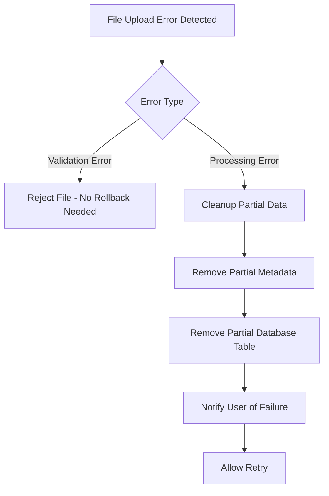

#### Database Transaction Rollback
```python
# Database rollback pattern
async def execute_with_rollback(operation_func, *args, **kwargs):
    """Execute database operation with automatic rollback on failure"""
    try:
        # Begin transaction
        conn = await get_database_connection()
        conn.execute("BEGIN TRANSACTION")
        
        # Execute operation
        result = await operation_func(conn, *args, **kwargs)
        
        # Commit transaction
        conn.execute("COMMIT")
        return result
        
    except Exception as e:
        # Rollback on any error
        conn.execute("ROLLBACK")
        logger.error(f"Database operation failed, rolled back: {e}")
        raise
    finally:
        conn.close()
```

### 3. Error Recovery Strategies

#### Automatic Retry Logic
```python
# Retry pattern for transient errors
async def retry_with_backoff(operation_func, max_retries=3, backoff_factor=2):
    """Retry operation with exponential backoff"""
    for attempt in range(max_retries):
        try:
            return await operation_func()
        except TransientError as e:
            if attempt == max_retries - 1:
                raise
            wait_time = backoff_factor ** attempt
            await asyncio.sleep(wait_time)
        except PermanentError as e:
            # Don't retry permanent errors
            raise
```

#### Graceful Degradation
```python
# Graceful degradation pattern
async def process_with_fallback(primary_func, fallback_func):
    """Try primary function, fallback to secondary on failure"""
    try:
        return await primary_func()
    except Exception as e:
        logger.warning(f"Primary function failed, using fallback: {e}")
        return await fallback_func()
```

---

## User Interaction Points and Decision Gates

### 1. Frontend User Interaction Flow

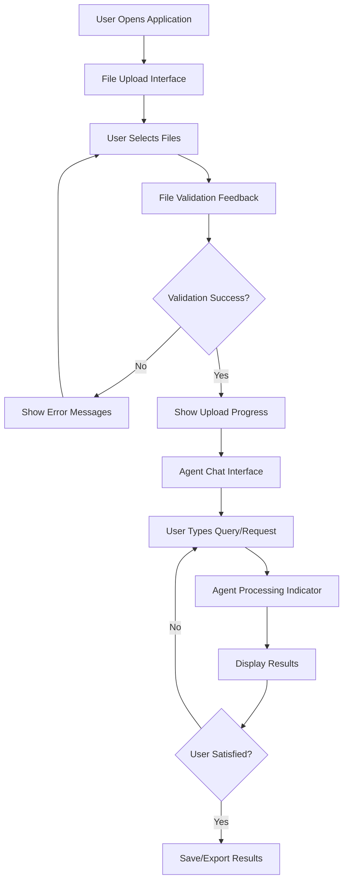

### 2. Decision Gates and User Approvals

#### File Upload Decision Gates
- **File Format Validation**: User must provide valid Excel files
- **File Size Limits**: User must keep files under 50MB each
- **File Count Limits**: Maximum 5 files per upload session
- **Duplicate File Detection**: User confirmation for duplicate filenames

#### Agent Processing Decision Gates
- **Document Classification**: User confirmation for new document types
- **Query Intent Clarification**: User disambiguation for unclear queries
- **Report Configuration**: User approval for report parameters
- **Data Privacy**: User confirmation for sensitive data processing

#### Error Recovery Decision Gates
- **Retry Confirmation**: User choice to retry failed operations
- **Fallback Acceptance**: User approval for simplified processing
- **Data Cleanup**: User confirmation for partial data removal

### 3. User Interface State Management

#### Component State Flow
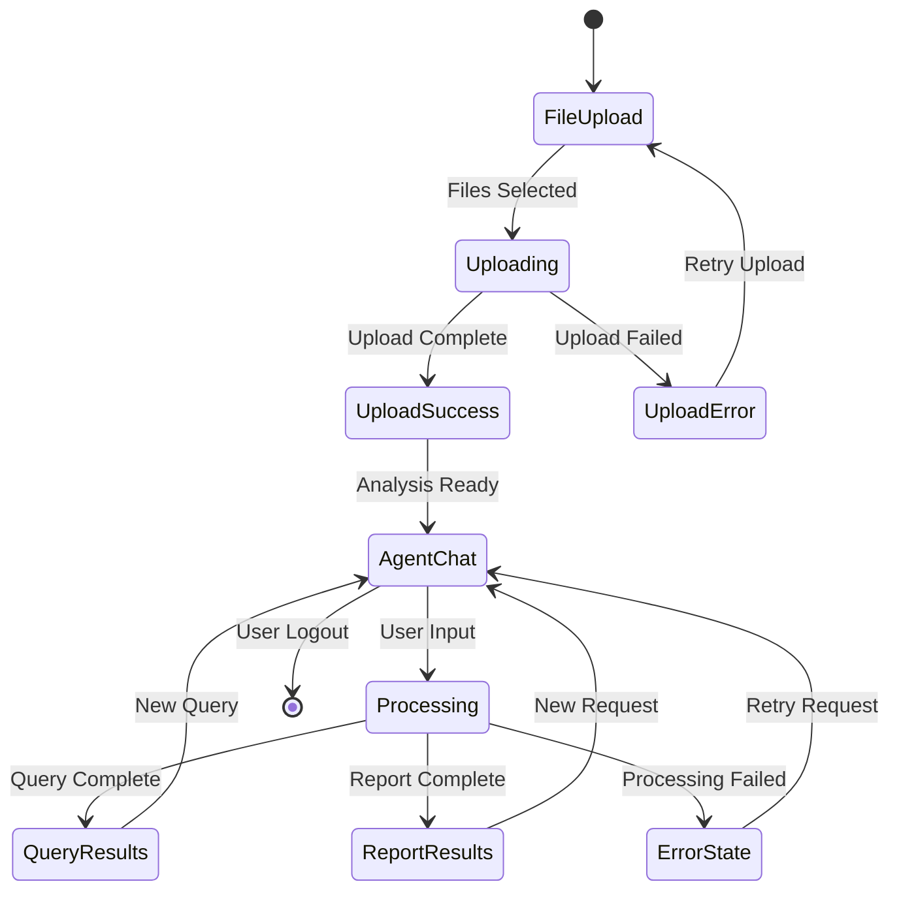

#### User Feedback Patterns
```javascript
// User feedback state management
const userFeedbackStates = {
  UPLOADING: {
    message: "Uploading files...",
    showProgress: true,
    allowCancel: true
  },
  PROCESSING: {
    message: "AI agents are processing your request...",
    showProgress: true,
    allowCancel: false
  },
  SUCCESS: {
    message: "Operation completed successfully",
    showProgress: false,
    allowCancel: false
  },
  ERROR: {
    message: "Operation failed, please try again",
    showProgress: false,
    allowCancel: true
  }
};
```

---

## Workflow Templates

### 1. Standard Query Workflow Template

```yaml
name: "Standard Query Workflow"
description: "Process user query through complete agent pipeline"
steps:
  1:
    name: "Input Processing"
    agent: "ChatAgent"
    action: "process_user_input"
    inputs: ["user_input", "localStorage_context"]
    outputs: ["structured_input"]
    
  2:
    name: "Intent Routing"
    agent: "OrchestrationAgent"
    action: "route_request_to_agent"
    inputs: ["structured_input"]
    outputs: ["routing_decision"]
    
  3:
    name: "Query Processing"
    agent: "QueryAgent"
    action: "process_query_request"
    inputs: ["structured_input", "routing_decision"]
    outputs: ["query_results"]
    
  4:
    name: "Result Persistence"
    agent: "QueryAgent"
    action: "save_query_automatically"
    inputs: ["query_results"]
    outputs: ["saved_query_id"]
    
  5:
    name: "Response Formatting"
    agent: "ChatAgent"
    action: "format_response"
    inputs: ["query_results", "saved_query_id"]
    outputs: ["formatted_response"]

error_handling:
  - step: 2
    error_type: "routing_failure"
    fallback: "default_to_query_agent"
  - step: 3
    error_type: "sql_generation_failure"
    fallback: "simplified_query_generation"
  - step: 4
    error_type: "database_error"
    fallback: "retry_with_validation"
```

### 2. Report Generation Workflow Template

```yaml
name: "Report Generation Workflow"
description: "Generate formatted report with filters and grouping"
steps:
  1:
    name: "Input Processing"
    agent: "ChatAgent"
    action: "process_user_input"
    inputs: ["user_input", "localStorage_context"]
    outputs: ["structured_input"]
    
  2:
    name: "Intent Routing"
    agent: "OrchestrationAgent"
    action: "route_request_to_agent"
    inputs: ["structured_input"]
    outputs: ["routing_decision"]
    
  3:
    name: "Report Configuration"
    agent: "ReportAgent"
    action: "generate_report_config"
    inputs: ["structured_input", "routing_decision"]
    outputs: ["report_config"]
    
  4:
    name: "SQL Generation"
    agent: "ReportAgent"
    action: "generate_report_sql"
    inputs: ["report_config"]
    outputs: ["report_sql"]
    
  5:
    name: "Data Processing"
    agent: "ReportAgent"
    action: "execute_report_query"
    inputs: ["report_sql"]
    outputs: ["report_data"]
    
  6:
    name: "Format Generation"
    agent: "ReportAgent"
    action: "generate_formatted_output"
    inputs: ["report_data", "report_config"]
    outputs: ["formatted_report"]
    
  7:
    name: "Result Persistence"
    agent: "ReportAgent"
    action: "save_report_automatically"
    inputs: ["formatted_report", "report_config"]
    outputs: ["saved_report_id"]

error_handling:
  - step: 3
    error_type: "config_generation_failure"
    fallback: "use_default_config"
  - step: 4
    error_type: "sql_generation_failure"
    fallback: "simplified_sql_generation"
  - step: 5
    error_type: "query_execution_failure"
    fallback: "retry_with_validation"
  - step: 6
    error_type: "format_generation_failure"
    fallback: "basic_text_format"
```

### 3. Multi-File Analysis Workflow Template

```yaml
name: "Multi-File Analysis Workflow"
description: "Process multiple Excel files with cross-file analysis"
steps:
  1:
    name: "File Upload"
    endpoint: "POST /upload"
    action: "upload_multiple_files"
    inputs: ["files[]"]
    outputs: ["upload_results"]
    
  2:
    name: "Sequential File Processing"
    agent: "UploadAgent"
    action: "process_multiple_files"
    inputs: ["upload_results"]
    outputs: ["processed_files"]
    
  3:
    name: "Cross-File Analysis"
    agent: "QueryAgent"
    action: "analyze_file_relationships"
    inputs: ["processed_files"]
    outputs: ["relationship_analysis"]
    
  4:
    name: "Unified Schema Creation"
    agent: "QueryAgent"
    action: "create_unified_schema"
    inputs: ["processed_files", "relationship_analysis"]
    outputs: ["unified_schema"]
    
  5:
    name: "Cross-File Query Interface"
    agent: "QueryAgent"
    action: "enable_cross_file_queries"
    inputs: ["unified_schema"]
    outputs: ["cross_file_capability"]

error_handling:
  - step: 1
    error_type: "file_validation_failure"
    fallback: "reject_invalid_files"
  - step: 2
    error_type: "file_processing_failure"
    fallback: "skip_failed_files"
  - step: 3
    error_type: "relationship_analysis_failure"
    fallback: "treat_files_independently"
```

---

## State Management Patterns

### 1. Frontend State Management

#### React State Flow
```javascript
// Main application state
const [appState, setAppState] = useState({
  phase: 'upload', // upload, analysis, query, report
  uploadedFiles: [],
  analysisResults: null,
  currentQuery: null,
  currentReport: null,
  error: null,
  loading: false
});

// State transitions
const stateTransitions = {
  UPLOAD_COMPLETE: (state, files) => ({
    ...state,
    phase: 'analysis',
    uploadedFiles: files,
    analysisResults: null
  }),
  ANALYSIS_COMPLETE: (state, results) => ({
    ...state,
    phase: 'query',
    analysisResults: results
  }),
  QUERY_COMPLETE: (state, query) => ({
    ...state,
    currentQuery: query,
    phase: 'report'
  }),
  ERROR_OCCURRED: (state, error) => ({
    ...state,
    error: error,
    loading: false
  })
};
```

#### Agent Chat State Management
```javascript
// Agent conversation state
const [chatState, setChatState] = useState({
  messages: [],
  currentFileIndex: 0,
  conversationStep: 0,
  conversationStatus: 'idle', // idle, processing, completed, error
  analysisResults: {},
  error: null
});

// State update patterns
const updateChatState = (action, payload) => {
  switch (action) {
    case 'START_CONVERSATION':
      return {
        ...chatState,
        conversationStatus: 'processing',
        messages: [...chatState.messages, payload.message]
      };
    case 'ADD_MESSAGE':
      return {
        ...chatState,
        messages: [...chatState.messages, payload.message]
      };
    case 'CONVERSATION_COMPLETE':
      return {
        ...chatState,
        conversationStatus: 'completed',
        analysisResults: payload.results
      };
    case 'CONVERSATION_ERROR':
      return {
        ...chatState,
        conversationStatus: 'error',
        error: payload.error
      };
    default:
      return chatState;
  }
};
```

### 2. Backend State Management

#### Agent Orchestrator State
```python
# Agent orchestrator state management
class AgentOrchestratorState:
    def __init__(self):
        self.active_conversations = {}
        self.agent_status = {}
        self.conversation_history = {}
        self.error_log = []
    
    def start_conversation(self, conversation_id: str, user_input: str):
        """Start new conversation with state tracking"""
        self.active_conversations[conversation_id] = {
            "user_input": user_input,
            "start_time": datetime.now(),
            "current_step": "chat_agent",
            "status": "processing"
        }
    
    def update_conversation_step(self, conversation_id: str, step: str):
        """Update conversation step in state"""
        if conversation_id in self.active_conversations:
            self.active_conversations[conversation_id]["current_step"] = step
    
    def complete_conversation(self, conversation_id: str, result: Dict[str, Any]):
        """Complete conversation and archive state"""
        if conversation_id in self.active_conversations:
            self.active_conversations[conversation_id].update({
                "status": "completed",
                "result": result,
                "end_time": datetime.now()
            })
            # Move to conversation history
            self.conversation_history[conversation_id] = self.active_conversations.pop(conversation_id)
```

#### Database State Management
```python
# Database state management patterns
class DatabaseStateManager:
    def __init__(self):
        self.connection_pool = {}
        self.transaction_state = {}
        self.rollback_log = []
    
    async def begin_transaction(self, transaction_id: str):
        """Begin database transaction with state tracking"""
        conn = await get_database_connection()
        conn.execute("BEGIN TRANSACTION")
        self.transaction_state[transaction_id] = {
            "connection": conn,
            "start_time": datetime.now(),
            "operations": []
        }
    
    async def log_operation(self, transaction_id: str, operation: str, params: Dict):
        """Log database operation for potential rollback"""
        if transaction_id in self.transaction_state:
            self.transaction_state[transaction_id]["operations"].append({
                "operation": operation,
                "params": params,
                "timestamp": datetime.now()
            })
    
    async def rollback_transaction(self, transaction_id: str):
        """Rollback transaction and log for analysis"""
        if transaction_id in self.transaction_state:
            conn = self.transaction_state[transaction_id]["connection"]
            conn.execute("ROLLBACK")
            
            # Log rollback for analysis
            self.rollback_log.append({
                "transaction_id": transaction_id,
                "operations": self.transaction_state[transaction_id]["operations"],
                "rollback_time": datetime.now()
            })
            
            del self.transaction_state[transaction_id]
```

---

## Monitoring and Alerting

### 1. Workflow Monitoring Metrics

#### Key Performance Indicators (KPIs)
```yaml
workflow_metrics:
  file_upload:
    - upload_success_rate: "Percentage of successful uploads"
    - average_upload_time: "Time from upload to processing complete"
    - file_validation_errors: "Count of validation failures"
    
  agent_processing:
    - agent_response_time: "Time from input to agent response"
    - routing_accuracy: "Percentage of correct agent routing decisions"
    - conversation_completion_rate: "Percentage of completed conversations"
    
  query_processing:
    - sql_generation_success_rate: "Percentage of successful SQL generation"
    - query_execution_time: "Average query execution time"
    - query_result_accuracy: "Percentage of accurate query results"
    
  report_generation:
    - report_generation_success_rate: "Percentage of successful report generation"
    - report_processing_time: "Average report processing time"
    - report_download_rate: "Percentage of generated reports downloaded"
```

#### Real-time Monitoring Dashboard
```javascript
// Monitoring dashboard state
const monitoringMetrics = {
  systemHealth: {
    databaseConnections: 0,
    activeAgents: 0,
    pendingRequests: 0,
    errorRate: 0.0
  },
  workflowMetrics: {
    uploadsPerMinute: 0,
    queriesPerMinute: 0,
    reportsPerMinute: 0,
    averageResponseTime: 0
  },
  errorMetrics: {
    totalErrors: 0,
    errorsByType: {},
    errorsByAgent: {},
    recentErrors: []
  }
};
```

### 2. Alerting Thresholds and Actions

#### Alert Configuration
```yaml
alerts:
  high_error_rate:
    threshold: "error_rate > 5%"
    action: "notify_admin"
    escalation: "page_oncall"
    
  slow_response_time:
    threshold: "avg_response_time > 10s"
    action: "scale_resources"
    escalation: "investigate_performance"
    
  agent_failure:
    threshold: "agent_failure_rate > 10%"
    action: "restart_agent"
    escalation: "investigate_agent_health"
    
  database_connection_issues:
    threshold: "db_connection_failures > 3"
    action: "restart_database_pool"
    escalation: "investigate_database"
```

#### Automated Response Actions
```python
# Automated response system
class WorkflowMonitor:
    def __init__(self):
        self.alert_thresholds = self.load_alert_config()
        self.response_actions = self.load_response_config()
    
    async def check_metrics(self):
        """Check metrics against thresholds and trigger alerts"""
        current_metrics = await self.collect_metrics()
        
        for alert_name, threshold in self.alert_thresholds.items():
            if self.evaluate_threshold(current_metrics, threshold):
                await self.trigger_alert(alert_name, current_metrics)
    
    async def trigger_alert(self, alert_name: str, metrics: Dict):
        """Trigger alert and execute response actions"""
        alert_config = self.response_actions[alert_name]
        
        # Execute immediate response actions
        for action in alert_config.get("immediate_actions", []):
            await self.execute_action(action, metrics)
        
        # Send notifications
        await self.send_notifications(alert_name, metrics)
        
        # Log for analysis
        await self.log_alert(alert_name, metrics)
```

---

## Testing Strategies

### 1. Workflow Testing Framework

#### End-to-End Workflow Tests
```python
# End-to-end workflow test framework
class WorkflowTestSuite:
    def __init__(self):
        self.test_scenarios = self.load_test_scenarios()
        self.test_data = self.load_test_data()
    
    async def test_complete_workflow(self, scenario_name: str):
        """Test complete workflow from upload to report generation"""
        scenario = self.test_scenarios[scenario_name]
        
        # Step 1: File Upload
        upload_result = await self.test_file_upload(scenario["files"])
        assert upload_result["success"], "File upload failed"
        
        # Step 2: Agent Analysis
        analysis_result = await self.test_agent_analysis(upload_result["files"])
        assert analysis_result["success"], "Agent analysis failed"
        
        # Step 3: Query Processing
        query_result = await self.test_query_processing(scenario["query"])
        assert query_result["success"], "Query processing failed"
        
        # Step 4: Report Generation
        report_result = await self.test_report_generation(scenario["report_config"])
        assert report_result["success"], "Report generation failed"
        
        return {
            "scenario": scenario_name,
            "upload": upload_result,
            "analysis": analysis_result,
            "query": query_result,
            "report": report_result,
            "overall_success": True
        }
```

#### Agent Conversation Tests
```python
# Agent conversation testing
class AgentConversationTestSuite:
    async def test_agent_routing(self, test_cases: List[Dict]):
        """Test agent routing accuracy"""
        for test_case in test_cases:
            # Test routing decision
            routing_result = await self.orchestration_agent.route_request_to_agent(
                test_case["structured_input"]
            )
            
            # Verify correct agent selected
            assert routing_result["target_agent"] == test_case["expected_agent"], \
                f"Expected {test_case['expected_agent']}, got {routing_result['target_agent']}"
            
            # Verify confidence score
            assert routing_result["routing_confidence"] >= test_case["min_confidence"], \
                f"Confidence too low: {routing_result['routing_confidence']}"
    
    async def test_agent_error_handling(self, error_scenarios: List[Dict]):
        """Test agent error handling and recovery"""
        for scenario in error_scenarios:
            # Simulate error condition
            result = await self.simulate_agent_error(scenario["error_type"])
            
            # Verify error handling
            assert result["success"] == False, "Error should be detected"
            assert "error" in result, "Error message should be present"
            assert result.get("fallback_action") == scenario["expected_fallback"], \
                f"Expected fallback {scenario['expected_fallback']}, got {result.get('fallback_action')}"
```

### 2. Performance Testing

#### Load Testing Scenarios
```python
# Load testing for workflow performance
class WorkflowLoadTest:
    async def test_concurrent_uploads(self, concurrent_users: int = 10):
        """Test concurrent file uploads"""
        tasks = []
        for i in range(concurrent_users):
            task = asyncio.create_task(self.simulate_user_upload(f"user_{i}"))
            tasks.append(task)
        
        results = await asyncio.gather(*tasks, return_exceptions=True)
        
        # Analyze results
        successful_uploads = sum(1 for r in results if isinstance(r, dict) and r.get("success"))
        average_response_time = sum(r.get("response_time", 0) for r in results if isinstance(r, dict)) / len(results)
        
        return {
            "concurrent_users": concurrent_users,
            "successful_uploads": successful_uploads,
            "success_rate": successful_uploads / concurrent_users,
            "average_response_time": average_response_time
        }
    
    async def test_agent_conversation_load(self, concurrent_conversations: int = 20):
        """Test concurrent agent conversations"""
        tasks = []
        for i in range(concurrent_conversations):
            task = asyncio.create_task(self.simulate_agent_conversation(f"conv_{i}"))
            tasks.append(task)
        
        results = await asyncio.gather(*tasks, return_exceptions=True)
        
        # Analyze conversation performance
        successful_conversations = sum(1 for r in results if isinstance(r, dict) and r.get("success"))
        average_conversation_time = sum(r.get("conversation_time", 0) for r in results if isinstance(r, dict)) / len(results)
        
        return {
            "concurrent_conversations": concurrent_conversations,
            "successful_conversations": successful_conversations,
            "success_rate": successful_conversations / concurrent_conversations,
            "average_conversation_time": average_conversation_time
        }
```

### 3. Integration Testing

#### API Integration Tests
```python
# API integration testing
class APIIntegrationTestSuite:
    async def test_upload_to_query_workflow(self):
        """Test complete API workflow from upload to query"""
        # Upload files
        upload_response = await self.client.post("/upload", files=self.test_files)
        assert upload_response.status_code == 200
        
        # Process through agents
        chat_response = await self.client.post("/autogen-chat", json={
            "user_input": "Show me all employees with salary > 50000",
            "localStorage_context": self.test_context
        })
        assert chat_response.status_code == 200
        
        # Verify query was generated and executed
        query_data = chat_response.json()
        assert query_data["success"] == True
        assert "sql" in query_data
        assert "rows" in query_data
        
        # Test report generation
        report_response = await self.client.post("/report", json={
            "query_text": "Generate a salary report by department",
            "doc_id": query_data["doc_id"]
        })
        assert report_response.status_code == 200
        
        report_data = report_response.json()
        assert report_data["success"] == True
        assert "output" in report_data
```

---

## Summary

This Workflow Orchestration Guide provides comprehensive documentation for:

1. **Complete User Workflows**: From file upload through analysis, query, and report generation
2. **Agent Conversation Flows**: Detailed mapping of agent interactions and decision points
3. **Multi-Step Process Mapping**: API call sequences and state management patterns
4. **Error Handling**: Comprehensive error classification and recovery procedures
5. **User Interaction Points**: Decision gates and approval workflows
6. **Workflow Templates**: Reusable patterns for common operations
7. **State Management**: Frontend and backend state management patterns
8. **Monitoring and Alerting**: Real-time monitoring and automated response systems
9. **Testing Strategies**: Comprehensive testing framework for workflow validation

This documentation enables seamless LangChain integration and provides a solid foundation for the AutoGen to LangChain migration process. All workflows are designed to be machine-readable and support automated agent orchestration.
